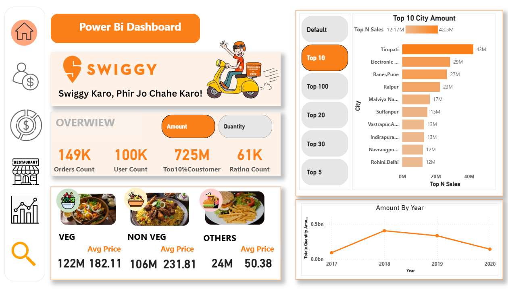
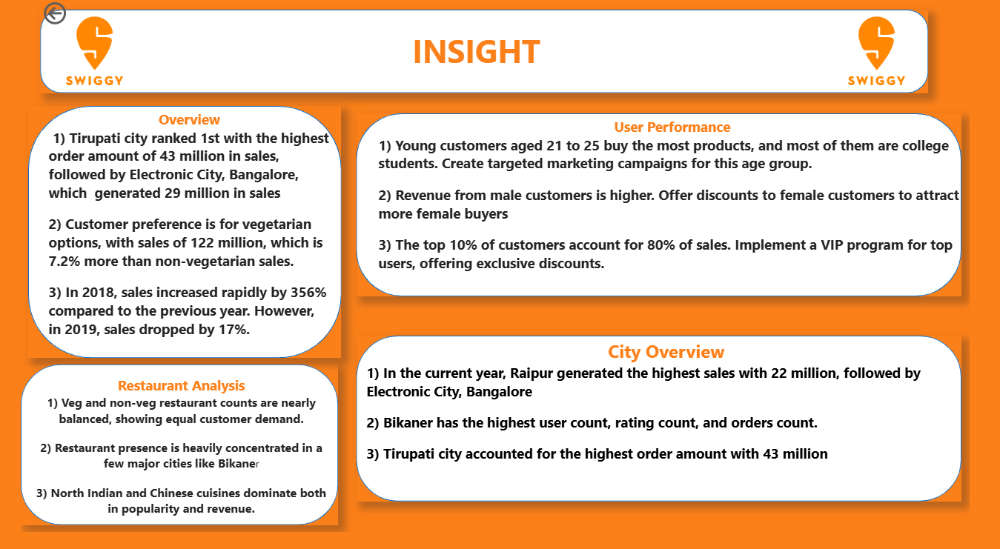

# Swiggy_Dashboard
Designed a Swiggy-themed Power BI dashboard to analyze sales, user activity, and restaurant performance. Used Power Query and DAX to clean data, create KPIs, and deliver interactive visual insights.
# Swiggy-Themed Power BI Dashboard – Sales & Restaurant Insights

🚀 **Live Dashboard:**  
[Click here to view the Power BI report](https://app.powerbi.com/view?r=eyJrIjoiOTNiNjg4MTQtY2VmOC00YmNiLTk3YmYtODYzN2ViN2YxMDM4IiwidCI6ImY5YTQzODQwLWY3OGUtNDE3Yy05ZDgwLTg5NTJhMmJhN2Y0YiJ9)

---


## 🖼️ Dashboard Previews

### 🔹 1. Overview  


### 🔹 2. User Performance  


### 🔹 3. City Overview  


### 🔹 4. Restaurant Analysis  


### 🔹 5. Insights  


## 📊 Project Overview

This project focuses on analyzing online food delivery performance inspired by Swiggy. The dataset contains order-level transactional data across multiple cities, restaurants, and user behaviors.

The Power BI dashboard helps answer critical business questions, such as:
- Which city has the highest order volume?
- Which restaurants are the top performers?
- What is the average order value per city or user?
- Who are the most active customers?

---

## 🔧 Tools & Technologies Used

- **Power BI Desktop**
- **DAX (Data Analysis Expressions)**
- **Power Query (M Language)**
- **Excel (for data pre-cleaning)**
- **Custom Visuals**

---

## 📁 Dataset

The dataset includes approximately **10,000+ rows** and contains the following columns:
- Order ID
- User ID
- City
- Restaurant Name
- Cuisine
- Order Date
- Item Count
- Total Amount
- Delivery Time
- Rating

---

## 📈 Dashboard Features

The dashboard is divided into 4 main report pages:

### 1. **User Overview**
- Total users
- Active vs Inactive users
- Average order per user
- Top 5 most active users (by order count)

### 2. **City Overview**
- Total orders by city
- Average delivery time by city
- City-wise revenue contribution
- Heat map for city-wise performance

### 3. **Restaurant Analysis**
- Top-performing restaurants
- Cuisine-wise distribution
- Average rating vs. revenue
- Filters for dynamic restaurant comparison

### 4. **Key KPIs & Insights**
- Total Revenue
- Average Order Value
- Customer Retention Overview
- Filters for Time Period, Cuisine, City, and Restaurant

---

## 📐 DAX Measures Used

Several **custom DAX measures** were created for dynamic calculations:

- `Total Revenue = SUM(Orders[Amount])`
- `Average Order Value = [Total Revenue] / DISTINCTCOUNT(Orders[Order ID])`
- `Order Count = COUNTROWS(Orders)`
- `Average Delivery Time = AVERAGE(Orders[Delivery Time])`
- `User Activity = DISTINCTCOUNT(Orders[User ID])`
- `Rating Category = SWITCH(TRUE(), ... )` *(for custom rating groups)*

---

## 🔄 Power Query (Data Transformation)

- Removed duplicates and nulls
- Split columns (City-State if applicable)
- Data type formatting
- Date and time standardization
- Merged multiple tables using relationships (1:M)

---

## 🎯 Filters and Slicers

- **Date slicer** (Year-Month)
- **City slicer**
- **Restaurant slicer**
- **Cuisine slicer**
- Dynamic cross-filtering between visuals

---

## 🧠 Key Insights

- **Top 3 cities** contribute to over 60% of total orders.
- **Fastest deliveries** are achieved in Tier 1 cities.
- A small number of **restaurants account for high revenue**.
- Some **users place frequent high-value orders** — potential for loyalty targeting.
- Delivery time correlates with user rating in some areas.

---

## 📌 What I Learned

- How to clean and model complex datasets using Power Query.
- Writing DAX functions for business logic.
- Designing interactive, user-friendly dashboards.
- Real-world storytelling with data.
- Publishing and sharing Power BI reports publicly.

---


## 📁 Project Structure

```yaml
PowerBI_Swiggy_Dashboard/
├── 📊 Swiggy_Dashboard.pbix              # Power BI report file
├── 📄 README.md                          # Project documentation
├── 📁 Screenshots/                       # Report page snapshots
│   ├── overview.png
│   ├── restaurant_insights.png
│   └── city_performance.png
└── 📄 Dataset.xlsx                       # Excel dataset used in dashboard


## 📮 Contact

Feel free to connect with me for feedback, collaborations, or internships:

- 📧 **Email:** [parlhadjadhav7@gmail.com]  
- 💼 **LinkedIn:** [www.linkedin.com/in/pralhad-jadhav-]

---

⭐ If you found this project useful, feel free to star the repo!
